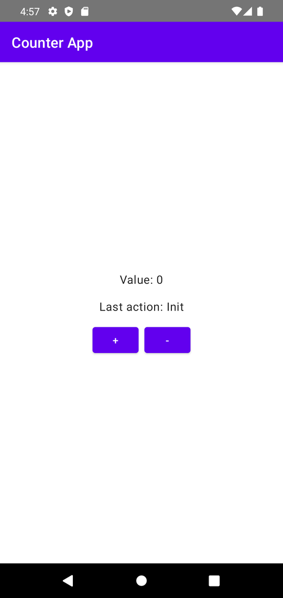
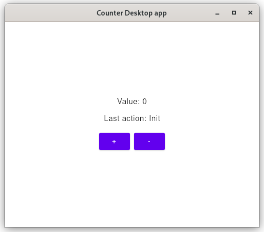
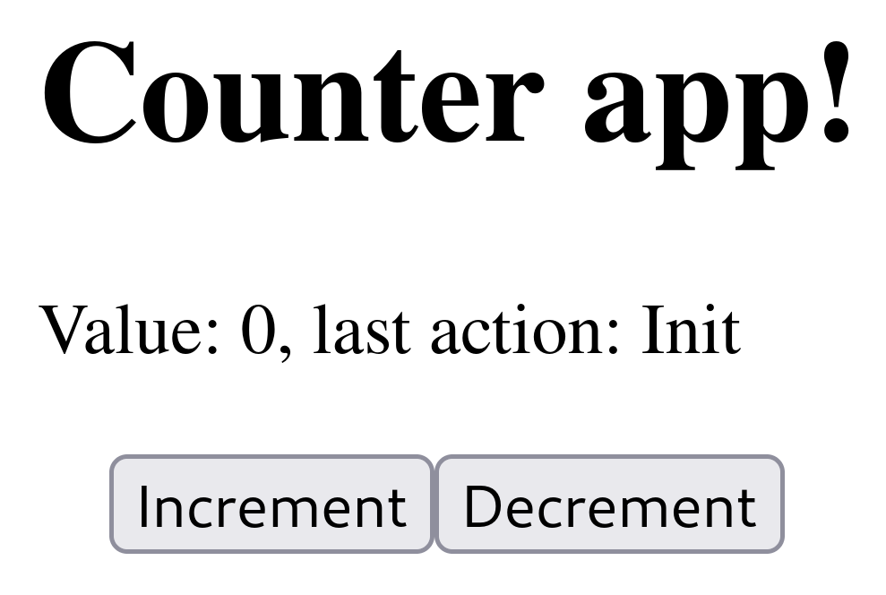

# Compose Multiplatform Demo Application - Android, Desktop, Web

|          Android          |         Desktop          |         Web          |
|:-------------------------:|:------------------------:|:--------------------:|
|  |  |  |

This is a demo application implementing a simple counter using Kotlin Compose Multiplatform,
it targets mobile (Android), desktop (Linux) and Web (using Compose Web).

## Architecture

The architecture of the project follows Clean Architecture and MVVM. Dependency injection is made using
`kodein-di`.

The structure of the project is as follows:

- `common`: contains the domain, data, use cases and the common presentation layer (in this case, view models).
- `android`: depends on `common`, implements the Android framework-dependent elements (in this case, the Main Activity) and Android UI
- `desktop`: depends on `common`, implements the Linux Desktop UI.
- `web`: depends on `common`, implements the web UI using Compose web.

Each platform (Android, Linux, Web) implements its own UI presentation, the view model is shared.
All UIs are implemented using Compose, on all platforms.

Sources that were used for this project:

- https://www.raywenderlich.com/3595916-clean-architecture-tutorial-for-android-getting-started
- https://docs.kodein.org/kodein-di/7.10/framework/compose.html
- https://github.com/JetBrains/compose-jb/tree/master/tutorials/Getting_Started